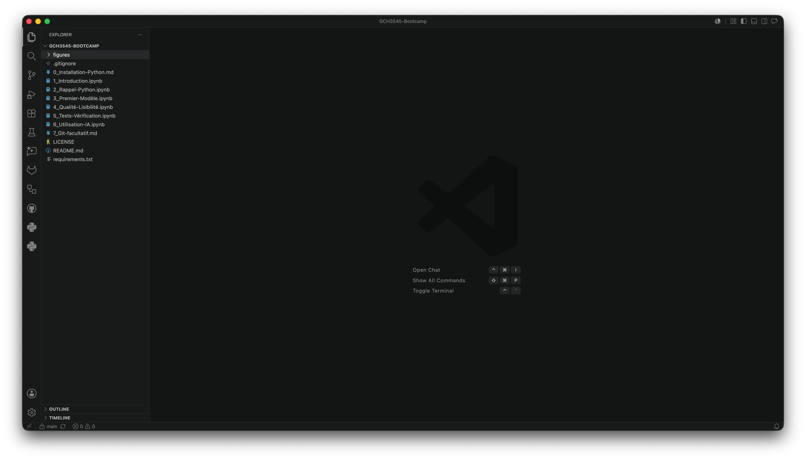
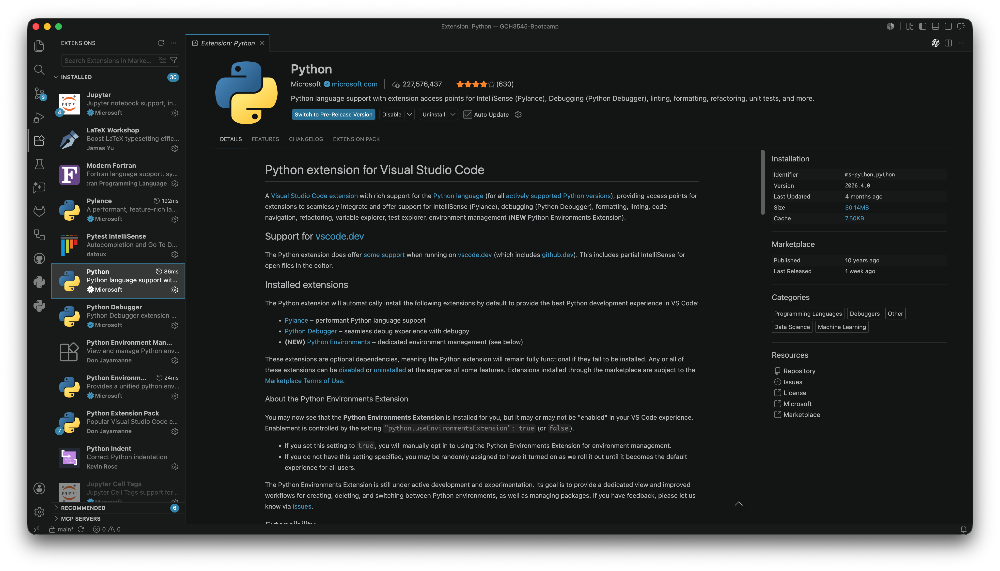
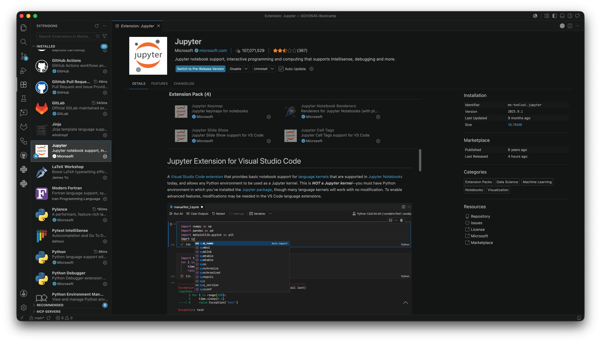
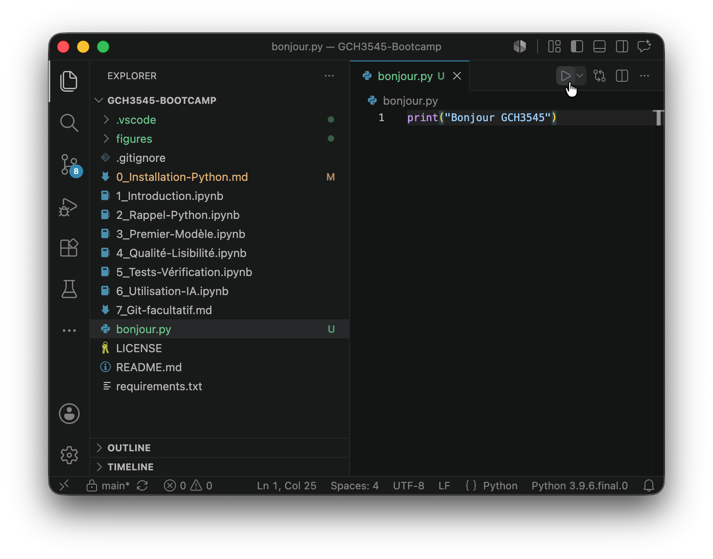

# Installation de l'environnement Python pour GCH3545
<p style="margin-top: -1.2em;">
Auteurs : Bruno Blais & Fabian Denner (Polytechnique Montréal)<br>
Licence : CC BY-SA 4.0
</p>

## Pourquoi ce guide ?

Dans le cours **GCH3545 – Modélisation numérique en ingénierie**, nous utiliserons Python pour résoudre des problèmes de modélisation numérique, analyser des résultats et produire des graphiques. Avant le premier TD, nous vous demandons d'installer l'environnement informatique qui sera utilisé pendant le bootcamp Python et tout au long du trimestre.

L'objectif de ce guide n'est pas de faire de vous un spécialiste en informatique. L'objectif est beaucoup plus simple : S'assurer que votre ordinateur est prêt à exécuter les notebooks et les programmes Python utilisés dans le cours.

Même si vous avez déjà suivi un cours de programmation, nous vous recommandons de suivre toutes les étapes de ce guide.

---

# Ce que nous allons installer

Avant de commencer, il est utile de comprendre ce que nous installons.

## Python

Python est le langage de programmation utilisé dans le cours.

On peut voir Python comme le « moteur » qui exécutera les programmes que nous écrirons.

## VS Code

VS Code est un environnement de développement.

Il permet notamment :

- d'écrire du code ;
- d'exécuter du code ;
- d'afficher des graphiques ;
- d'utiliser des notebooks Jupyter ;
- d'organiser les fichiers d'un projet.

## Bibliothèques Python

Python possède de nombreuses bibliothèques spécialisées.

Dans ce cours, nous utiliserons notamment :

- **NumPy** pour le calcul numérique ;
- **Matplotlib** pour produire des graphiques ;
- **pytest** pour vérifier automatiquement le fonctionnement d'un programme.

À la fin de ce guide, vous devriez être capable d'exécuter un notebook Python simple sur votre ordinateur.

---

# 1. Installer Python

Commencez par vérifier si Python est déjà installé sur votre ordinateur. 

Si ce n'est pas le cas, téléchargez la dernière version stable de Python à partir du site officiel :
https://www.python.org/downloads/

Suivez ensuite les instructions d'installation correspondant à votre système d'exploitation. Les options proposées par défaut sont généralement suffisantes.

### Pourquoi installons-nous Python ?

Lorsque vous écrivez un programme Python, votre ordinateur ne comprend pas directement les instructions contenues dans le fichier.

Python agit comme un interprète :

```text
Programme Python
       ↓
     Python
       ↓
Résultat affiché à l'écran
```

Sans Python, les fichiers `.py` et les notebooks du cours ne peuvent pas être exécutés.

### Vérifier que Python fonctionne

Une fois l'installation terminée, ouvrez un terminal.

**Sous Windows** : Ouvrez **Invite de commandes** ou **PowerShell**.

**Sous macOS** : Ouvrez **Terminal**.

**Sous Linux** : Ouvrez votre terminal habituel.

Tapez ensuite :

```bash
python --version
```

Vous devriez obtenir un résultat semblable à :

```text
Python 3.13.2
```

Le numéro exact de version peut être différent.

### Que vérifie cette commande ?

Cette commande demande simplement à Python de s'identifier.

Si un numéro de version apparaît, cela signifie que :

- Python est installé ;
- le système sait où le trouver ;
- les programmes Python pourront être exécutés.

---

# 2. Installer VS Code

Nous utiliserons **Visual Studio Code (VS Code)** pendant le bootcamp et pour les activités du cours.

Téléchargez-le à l'adresse suivante : https://code.visualstudio.com/

Installez-le en conservant les options proposées par défaut.

### Pourquoi utilisons-nous VS Code ?

Il est possible d'écrire des programmes Python avec un simple éditeur de texte. Cependant, cela devient rapidement peu pratique. VS Code regroupe dans une même interface :

- l'édition du code ;
- l'exécution des programmes ;
- les notebooks Jupyter ;
- les graphiques ;
- contrôle et gestion des différentes versions de votre code (voir [7_Git-facultatif.md](7_Git-facultatif.md)) ;
- différents outils d'aide à la programmation.

Nous utiliserons donc VS Code comme environnement principal.

### Vérifier que VS Code fonctionne

Lancez VS Code.

Si une fenêtre s'ouvre correctement, l'installation est terminée.



---

# 3. Installer les extensions Python et Jupyter

VS Code peut être enrichi grâce à des extensions qui ajoutent des fonctionnalités supplémentaires au logiciel. Pour ce cours, deux extensions sont nécessaires.

### Extension Python

Dans VS Code :

1. Cliquez sur l'onglet **Extensions**.
2. Recherchez **Python**.
3. Installez l'extension publiée par **Microsoft**.



Cette extension permet à VS Code de comprendre le langage Python. Sans elle, VS Code serait simplement un éditeur de texte.

### Extension Jupyter

Toujours dans l'onglet Extensions :

1. Recherchez **Jupyter**.
2. Installez l'extension publiée par **Microsoft**.



Les activités du bootcamp sont fournies sous forme de notebooks Jupyter. Cette extension permet à VS Code d'ouvrir et d'exécuter ces notebooks.

---

# 4. Installer les bibliothèques nécessaires

Python est volontairement minimal. Les fonctionnalités spécialisées sont généralement ajoutées sous forme de **bibliothèques**, qui apportent des outils adaptés à des domaines particuliers, comme le calcul scientifique ou la visualisation de données.

Avant d'installer ces bibliothèques, nous vous recommandons de créer un **environnement virtuel**. Cette étape est facultative, mais elle constitue une bonne pratique.

Un environnement virtuel est un dossier qui contient une installation Python propre à votre projet. Il permet d'éviter les conflits entre les bibliothèques utilisées par différents projets Python installés sur votre ordinateur.

### Créer un environnement virtuel (recommandé)

#### Sous macOS ou Linux

```bash
python3 -m venv .venv
source .venv/bin/activate
```

#### Sous Windows

```cmd
python -m venv .venv
.venv\Scripts\activate
```

Une fois l'environnement activé, son nom (généralement `.venv`) apparaît au début de la ligne de commande du terminal. Cela indique que toutes les bibliothèques installées seront associées à ce projet plutôt qu'à l'installation globale de Python.

### Installer les bibliothèques du bootcamp

Exécutez ensuite la commande suivante :

```bash
pip install numpy matplotlib pytest
```

Cette commande installe les trois bibliothèques qui seront utilisées pendant le bootcamp :

- **NumPy** : calcul numérique ;
- **Matplotlib** : production de graphiques scientifiques ;
- **pytest** : vérification automatique du fonctionnement d'un programme.

L'installation peut prendre quelques minutes.

### Que signifie cette commande ?

Le programme `pip` est le gestionnaire de bibliothèques de Python. On peut voir `pip` comme un magasin d'applications pour Python.

La commande précédente demande à Python d'installer trois bibliothèques :

- **numpy** permet d'effectuer efficacement des calculs numériques. Nous l'utiliserons dans pratiquement toutes les activités du cours.
- **matplotlib** permet de produire des graphiques scientifiques.
- **pytest** permet d'automatiser des vérifications sur un programme. 

---

# 5. Vérifier l'installation de Python

Dans VS Code, créez un nouveau fichier `bonjour.py` contenant :

```python
print("Bonjour GCH3545")
```

Enregistrez le fichier.

Pour l’exécuter :

1. Cliquez n’importe où dans le fichier.
2. Cliquez sur le bouton ▶︎ situé dans le coin supérieur droit de VS Code.

<p align="left">
  
</p>

Une fenêtre de terminal devrait alors s’ouvrir automatiquement dans la partie inférieure de VS Code. Vous devriez voir apparaître :

```text
Bonjour GCH3545
```

### Que vient-il de se passer ?

Lorsque vous avez cliqué sur ▶︎, VS Code a demandé à Python d’exécuter le contenu du fichier `bonjour.py`.

Python a lu l’instruction :

```python
print("Bonjour GCH3545")
```

et a affiché le texte correspondant dans le terminal.

### Pourquoi faisons-nous ce test ?

Ce test est volontairement très simple.

Il permet de vérifier simultanément que :

- Python fonctionne ;
- VS Code fonctionne ;
- VS Code est capable de communiquer avec Python.

Si cette étape réussit, nous savons déjà qu'une grande partie de l'installation est correcte.

---

# 6. Problèmes fréquents

### « python n'est pas reconnu »

Python n'est probablement pas correctement installé ou le terminal ne sait pas où le trouver. 

Vérifiez que l'installation est terminée puis redémarrez le terminal.

### « pip n'est pas reconnu »

Commencez par vérifier que :

```bash
python --version
```

fonctionne correctement.

### VS Code ne trouve pas Python

Dans VS Code, ouvrez la palette de commandes puis recherchez :

```text
Python: Select Interpreter
```

Sélectionnez l'installation Python que vous venez d'installer.

### Le notebook refuse de s'exécuter

Vérifiez que :

- l'extension Jupyter est installée ;
- l'interpréteur Python correct est sélectionné.

---

# Besoin d'aide ?

Si vous rencontrez toujours un problème après avoir suivi ce guide, ne vous inquiétez pas.

Apportez simplement votre ordinateur au premier TD.

L'équipe d'encadrement pourra vous aider à finaliser l'installation.

L'objectif est que tout le monde puisse participer au bootcamp, même sans expérience particulière en informatique.
